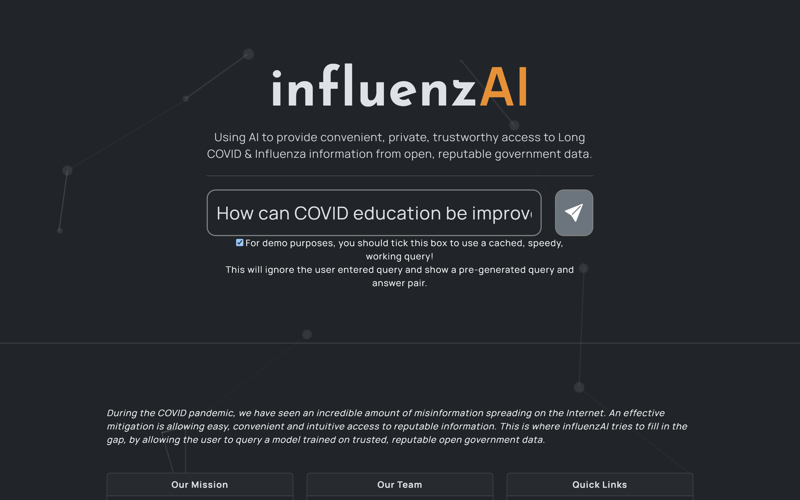
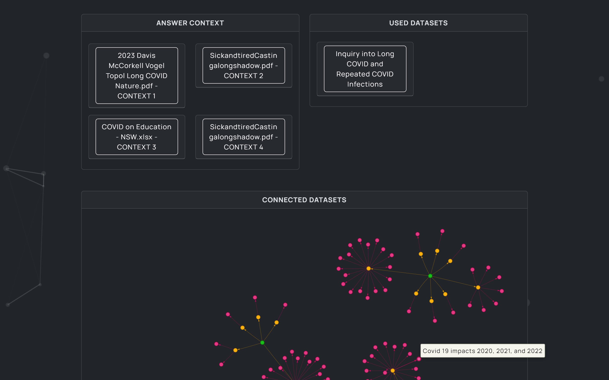

<html>
    <p align='center'>
        
    </p>
</html>

# influenzAI

*Conveniently providing trustworthy information to people suffering from Influenza and Long COVID, using AI trained on reputable government data, and with an emphasis on privacy.*

| Landing Page                 | Query Results                | Connected Datasets           |
| ---------------------------- | ---------------------------- | ---------------------------- |
|  |  |  |

## Our Mission

During the COVID pandemic, we have seen an incredible explosion of information. However, clinicians are unable to efficiently incorporate the ever-expanding sea of data into their clinical practice. An effective mitigation is leverage emergeing generative AI technology to allow easy, convenient and intuitive access to reputable information.

This is where InfluenzAI tries to fill in the gap. It is a generative AI solution powered by LocalGPT that allows clinicians to query a model trained on trusted, reputable open government data. By ethically curating the data we ingest onto the large language model, we strive to mitigate bias and influence, and aim for inclusivity and neutrality.

While currently targeted at busy clinicians, we believe that there is an opportunity in education for healthcare students to utilise this platform. InfluenzAI will show the source data and related data used to generate its answers, thus making it a convenient yet comprehensive medical resource.

Data security and patient privacy is paramount, thus we self-hosted the large language model ourselves and made sure that no patient identifiable information are stored, let alone sent out to third parties. For transparency and discoverability, InfluenzAI will show you the exact datasets used to respond to the query. Furthermore, it will show you *related* datasets to broaden your knowledge and understanding.

### Accessibility

1. Querying is done using natural language prompts, instead of scrolling through oceans of documents. A person should not need to think like a computer when querying answers!
2. Using features such as voice to text, we improve convenience by reducing typing on phones for busy medical practitioners, and emphasising on accessibility to people new to this technology.
3. A minimalist, responsive UI which focuses on the queries and responses. With this project's architecture, different UIs can be built for different kinds of scenarios and devices.

### Scaling Potentials

Of course, Long COVID and Influenza are a drop in the ocean - there are plenty of other health issues and concerns people have. Using a diverse range of open government data, we can augment our LLM with additional knowledge of other topics, and reach new audiences whom would benefit from a convenient, informative and private source of healthcare information.

From a technical perspective, InfluenzAI has been architected with the intent of being modular and scalable. We can leverage container orchestration to scale up the project as necessary, with minimal difficulties.

While InfluenzAI focuses on Influenza and long COVID, our long-term plan is to expand to other pathogens and use InfluenzAI as a stepping stone towards VirAI.

### Interactive and Visual

To improve the depth of responses, we are building our own system which visualises government data using intuitive, useful charts and maps. This bespoke system would respond to known queries (e.g. "long covid trends in 2023") using visual responses, as a complement to the text-based responses from our LLM.

### Privacy

Privacy is paramount in healthcare, which is why our solution uses a self-hosted ML trained on open government data.

Queries do not get exposed to third-party solutions, and we refrain from gathering personal information from people.

### Bias Mitigation

Our architecture and self-hosted model grants us control over our model, and thus permits us to minimise external bias. The challenge of bias lies in the government data itself, which we can curate using an ethical protocol that focuses on inclusivity, diversity and authenticity.

### Openness and Transparency

To improve openness and transparency, we visually display all the documents/datasets used for our model. This allows our model to be scrutinised for any unintended biases, and provides users/stakeholders with confidence in the potential & quality of our model.

## Our Team

In alphabetical order...

| Member    | Role                                   |
| --------- | -------------------------------------- |
| David     | Data Analysis / Content Creator        |
| Dhanush   | Quality Assessment Lead                |
| Emilian   | Lead Developer / Architect / UI Layout |
| Jacky     | Content Creator, Industry Insight      |
| Kien Pham | Website UI/UX Design                   |
| Shann     | Data Analyst / Curator / Narrator      |
| Sudeep    | Graphic / Logo Design                  |
| William   | Project Manager / Content Creator      |

## Architecture

InfluenzAI consists of four major components:

1. The InfluenzAI Web Interface, a PHP platform which provides a minimalist and beautiful UI to the end-user for querying and responses.
2. The InfluenzAI Database, which stores metadata (name, source, keywords, etc.) for the documents fed into localGPT. Using this metadata, we can provide accurate *and* related datasets relevant to the query.
3. The InfluenzAI Brdiging API, which sits in-between the Web Interface and the LLM back-end (LocalGPT for our prototype).
4. The back-end LLM, which ingests the provided open government data and responded to the inbound user queries.


Using this architecture, the components remain decoupled and scalable. This opens up the opportunities for alternative UIs (e.g. mobile apps) and LLMs (e.g. LLaMA).

## Instructions

```
python localGPTUI.py --host 0.0.0.0
python run_localGPT_API.py --host 0.0.0.0 --device_type cuda
```

## Attributes

- localGPT: https://github.com/PromtEngineer/localGPT
